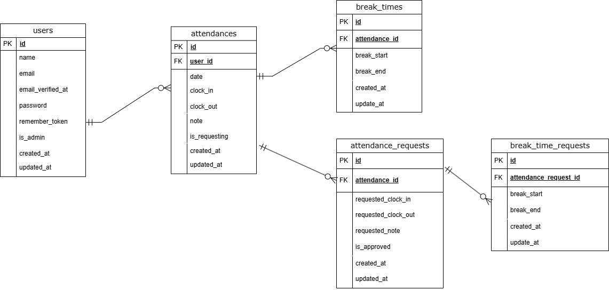

# 勤怠管理システム - Laravel

## 📌 概要
このアプリケーションは、一般ユーザーと管理者の両方の役割に対応した勤怠管理システムです。  
出勤・退勤・休憩・修正申請などの勤怠情報を記録・管理し、管理者が申請を承認する機能を備えています。

---

## 🔐 認証
Laravel Fortify を利用したユーザー認証（メール認証含む）を導入しています。

- 会員登録／ログイン：Fortify
- メール認証：必須
- 管理者判定：`can:admin` ミドルウェアによるアクセス制御

## 📧 メール認証（Mailtrap）

開発中のメール認証は **Mailtrap** を使用しています。

- **Mailtrap ダッシュボード**: [https://mailtrap.io/](https://mailtrap.io/)
- **使用Inbox**: `{あなたのInbox名}`

### 必要な設定

`.env` ファイルに以下の設定を追加してください：

```env
MAIL_MAILER=smtp
MAIL_HOST=sandbox.smtp.mailtrap.io
MAIL_PORT=2525
MAIL_USERNAME=xxxxxxxxxxxxxx
MAIL_PASSWORD=xxxxxxxxxxxxxx
MAIL_ENCRYPTION=null
MAIL_FROM_ADDRESS=no-reply@example.com
MAIL_FROM_NAME="勤怠管理システム"
```
---

## 🧭 ルーティング概要

### 一般ユーザー
| 機能 | パス | コントローラ/アクション |
|------|------|--------------------------|
| 出勤画面表示 | `/attendance` | `AttendanceController@index` |
| 勤怠一覧 | `/attendances` | `AttendanceController@monthly` |
| 勤怠詳細 | `/attendances/{id}` | `AttendanceController@show` |
| 修正申請 | `/attendances/{id}/request-edit` | `AttendanceController@requestEdit` |
| 修正申請一覧 | `/my-requests` | `AttendanceController@requestList` |

### 管理者
| 機能 | パス | コントローラ/アクション |
|------|------|--------------------------|
| 日別勤怠一覧 | `/admin/attendances` | `Admin\AttendanceController@daily` |
| 勤怠詳細 | `/admin/attendances/{id}` | `Admin\AttendanceController@show` |
| ユーザー一覧 | `/admin/users` | `UserController@index` |
| 月次勤怠 | `/admin/users/{id}/monthly` | `UserController@showMonthlyAttendance` |
| 申請一覧 | `/admin/requests` | `RequestController@index` |
| 申請詳細 | `/admin/requests/{id}` | `RequestController@show` |
| 申請承認 | `/admin/requests/{id}/approve` | `RequestController@approve` |

---

## 🖼️ 画面構成（Bladeファイル）

- `resources/views/auth/`  
  - `login.blade.php`, `register.blade.php`
- `resources/views/attendance/`  
  - 出勤登録・一覧・詳細・申請画面など
- `resources/views/admin/`  
  - 管理者側の日別勤怠、ユーザー一覧、申請一覧など

---

## ✅ バリデーション

| ファイル | 対象フォーム | 主なルール |
|----------|--------------|------------|
| `RegisterRequest` | 会員登録 | name, email, password（必須・形式チェック） |
| `LoginRequest` | ログイン | email, password（必須） |
| `AttendanceEditRequest` | 勤怠修正申請 | 出退勤、休憩、備考の時刻・整合性チェック |

---

📊 ER図


---
## 🛠️ 環境構築

### 使用技術

- Laravel 10.48.29
- PHP 8.2.28
- MySQL 8.0.26
- OS: Ubuntu 22.04 (WSL2)
- Docker, Mailtrap

### 設定手順

```bash
# 1. Makefileによる初期設定
$ git clone https://github.com/your-user/your-repo.git
$ cd your-repo
$ make init

# 2. Laravel 初期設定（手動の場合）
$ docker compose exec php bash
$ composer install
$ php artisan key:generate
$ php artisan migrate --seed

```
### ログイン画面の共通化
本アプリでは、管理者と一般ユーザーのログイン画面を共通化しています。
ユーザーの権限（管理者 / 一般）は、ログイン後のリダイレクトによって自動的に振り分けられます。
そのため、管理者専用のログイン画面はありません。ログイン画面デザインも共通のものを適用しています。

---
## 🔧 勤怠修正申請における休憩時間の設計

本アプリでは、勤怠修正申請において「休憩時間」も申請対象に含める必要があるため、以下のように設計しています。

### 設計意図
休憩は1日に何回でも発生する可能性があるため、固定カラムで保持するのではなく、申請1件に対して複数の休憩時間レコードを関連付ける構造を採用しました。

これにより、以下の点を実現しています：
- 可変回数の休憩に柔軟に対応可能
- データ構造の正規化（1対多の関係）
- 拡張性の確保（将来的な休憩種別・備考追加なども可能）

### 実装概要
- `attendance_requests` テーブルは勤怠修正申請の本体情報（出勤・退勤・備考）を保持
- `break_time_requests` テーブルにて、対応する休憩時間の開始・終了を複数保存
- `attendance_request_id` によって両テーブルがリレーションされ、申請単位で休憩がまとめられる

### 想定ユースケース
- 1日2回の休憩 → 2レコードとして保存
- 深夜勤務や特殊シフトで3回以上休憩する場合も対応可能

このように、可変長データを別テーブルで管理することで、仕様に対する柔軟性とデータ構造の明確化を両立する設計を行いました。

---
## 💬 補足
- デザインは Bootstrapベース、またはカスタムCSSで調整
